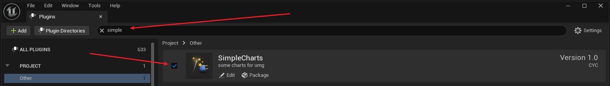
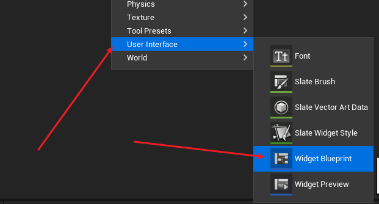
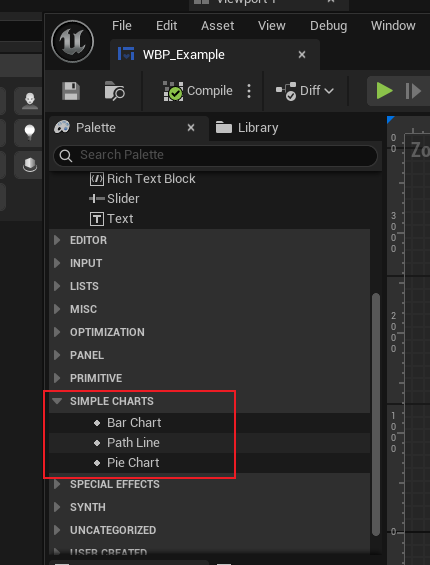
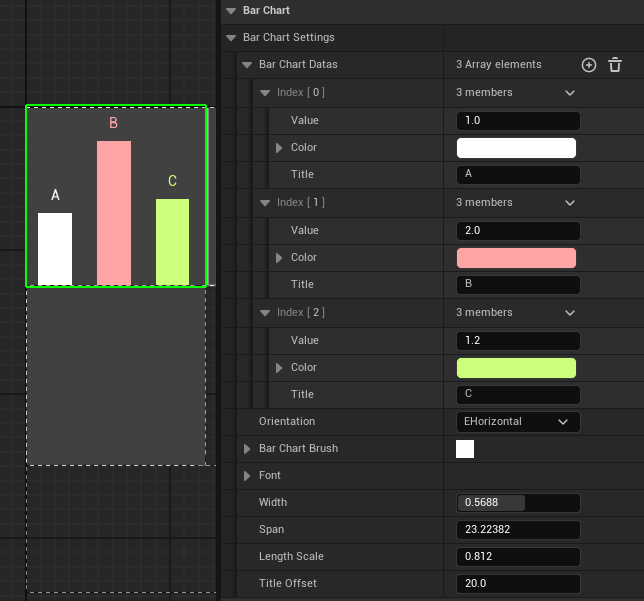
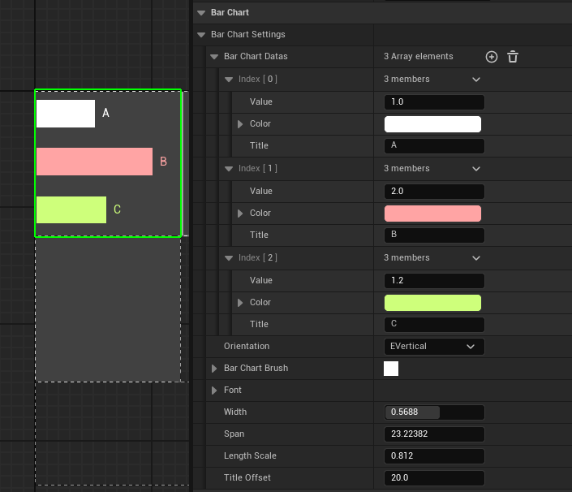
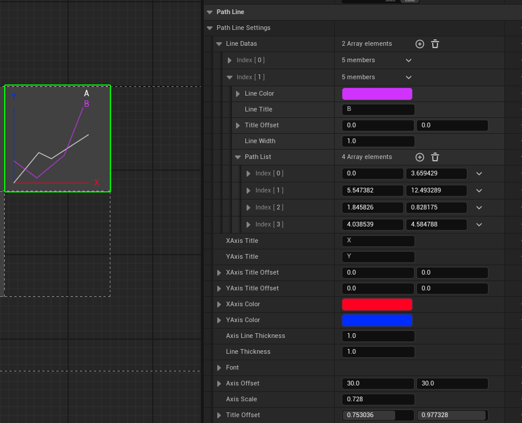
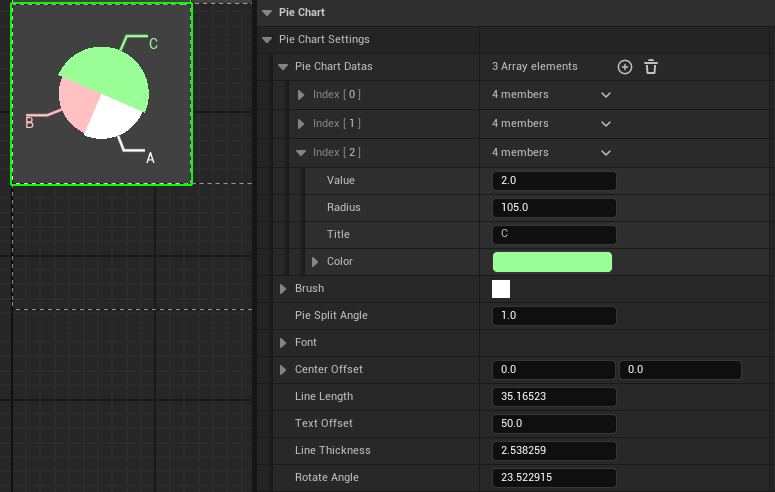
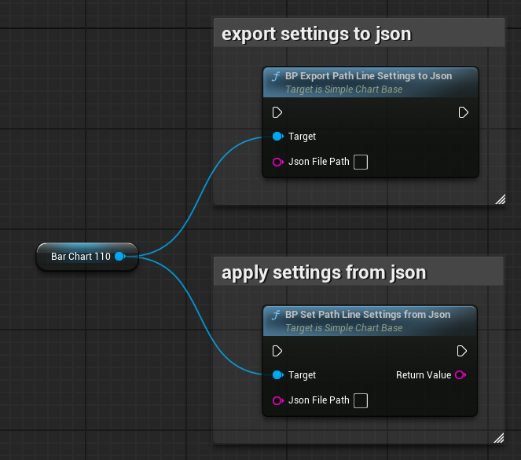

# how to start

1. enable the plugin


2. create a widget 


3. selete the widget component from Simple Charts category
```
All the Widget components are under the **Simple Charts** category.
```


4. modify the settings


```
Each component has a built-in variable named **ComponentName + Settings**.  
By modifying this variable, you can change the display of the Widget.
```

# BarChart




# PathLine



# PieChart



# functions

You can use functions to **export the Settings to a JSON file**, and also **load configurations from a JSON file**.

